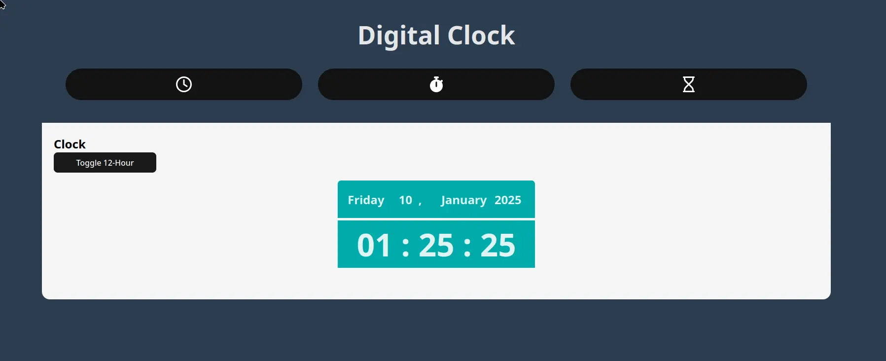
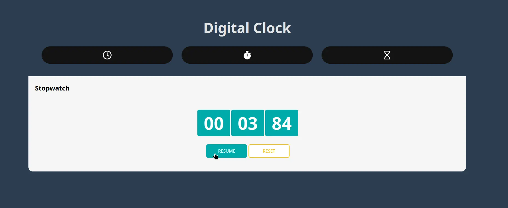
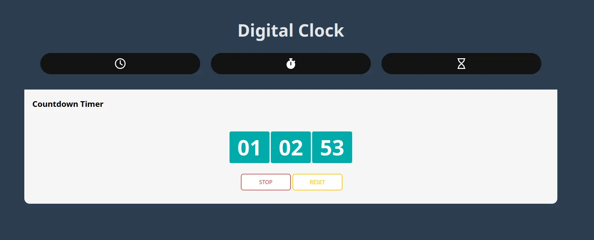

# React Clock Application


This is a comprehensive React-based application that provides three main functionalities: a **Clock**, a **Countdown Timer**, and a **Stopwatch**. The app is built with modern web technologies and provides an intuitive user interface for tracking time in various ways.

## 🚀 Live Demo

Click [here](https://digital-clock-inky-pi.vercel.app/) to access the deployed project and test its features.

## 📋 Features

### 🕒 Clock



- Displays the current time in **hours**, **minutes**, and **seconds**.
- Shows the **day**, **date**, and **month** in a user-friendly format.
- Automatically up

### ⏱️ Stopwatch



- Tracks elapsed time with precision.
- Features:
  - **Start**: Begin the stopwatch.
  - **Pause/Resume**: Pause the time and resume from where you left off.
  - **Reset**: Reset the stopwatch to zero.

### ⏳ Countdown Timer



- Allows users to set a specific duration in hours, minutes, and seconds.
- Features:
  - **Start/Pause**: Start the countdown or pause it at any point.
  - **Reset**: Reset the timer back to the initial value.
  - **Input Validation**: Ensures the timer inputs are valid and non-negative.
  - **Disabling Inputs**: Prevents changes to the time while the countdown is running.

## 🛠️ Technologies Used

### Frontend

- **React**: Core library for building the user interface.
- **Vite**: Development environment for faster builds and hot module replacement.
- **CSS Modules**: For styling and maintaining scoped styles.

### Icons

- **FontAwesome**: Used for incorporating visually appealing icons in buttons and components.

### Additional Libraries

- **React Hooks**: Efficient state and effect management using `useState` and `useEffect`.

## 🚦 How to Run Locally

1. **Clone the repository:**

   ```bash
   git clone https://github.com/Wayfarerdesert/DigitalClock.git
   cd DigitalClock

   ```

2. Install dependencies:
   `npm install`

3. Start the development server:
   `npm run dev
`
